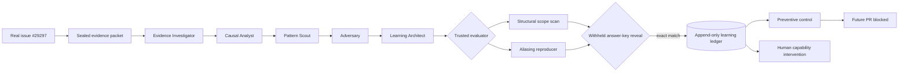

# Architecture

## One trustworthy institutional-learning loop



## Evidence boundary

The benchmark has two deliberately separate data structures.

### Allowed packet

`allowed_evidence_packet()` contains:

- original public issue metadata;
- bounded source excerpts from pre-fix commit `d7150bfaeae6`;
- the mutating `NewWrapperMounter` call path; and
- constraints requiring causal rather than textual equivalence.

### Withheld answer key

`WITHHELD_GROUND_TRUTH` contains:

- merged PR `kubernetes/kubernetes#29641`;
- its expected four plugin paths; and
- the historical fresh-object remediation.

The answer key is not serialized into the agent message. Unit tests assert that `29641` and
`expected_paths` do not appear in the allowed packet. Comparison occurs only after agent
artifacts and deterministic findings are frozen.

## Agent roles

| Agent | Responsibility | May verify the claim? |
|---|---|---|
| Evidence Investigator | Separate observed signals, hypotheses, and evidence limits | No |
| Causal Analyst | Derive the failure mechanism, class, and reusable invariant | No |
| Pattern Scout | Identify candidates satisfying the complete causal signature | No |
| Adversary | Design a deterministic falsifier and safe control | No |
| Learning Architect | Propose code, process, ownership, and capability actions | No |
| Trusted evaluator | Execute structural checks and aliasing/fresh-object controls | **Yes** |
| Ground-Truth Judge | Compare frozen findings with the withheld historical patch | **Yes** |
| Ledger verifier | Verify every event and previous-hash link | **Yes** |

ADK's `SequentialAgent` runs the five `LlmAgent` specialists. Every specialist has a Pydantic
`output_schema` and `output_key`; ADK validates the result and writes it to session state for
the next role. A successful live trace contains five terminal structured outputs and is labeled
`vertex-adk:gemini-3.5-flash`.

## Causal evaluator

The structural evaluator requires every clause below:

1. a package-level reusable `wrappedVolumeSpec`;
2. a nested `*api.Volume` pointer;
3. reuse of that value in `NewWrapperMounter`; and
4. request-specific mutation of `spec.Volume.Name` in the host.

This avoids treating keyword or API similarity as proof.

The deterministic reproducer shallow-copies one spec into Mount A and Mount B. Both outer
objects point to the same nested volume. After this interleaving:

```text
A writes wrapped_config-a
B writes wrapped_config-b
A reads  wrapped_config-b  ← invariant falsified
```

The safe control constructs a fresh nested object per mount; A and B retain distinct names.

## Append-only learning ledger

Each event hash is computed from canonical JSON containing:

```text
sequence + learning_id + event_type + actor + timestamp + payload + previous_hash
```

The first event points to `GENESIS`; each later event points to the previous event hash. The
public class has `append`, `list`, and `verify` operations—no update or delete operation.
Deep copies prevent callers from mutating stored events through returned references.

The demo chain is:

```text
HYPOTHESIS_RECORDED
  → EVIDENCE_VERIFIED
  → GROUND_TRUTH_CONFIRMED
  → CONTROL_ATTACHED
```

## Product architecture

The same evidence and learning model powers seven routes:

- `/overview` — organization-level velocity, value, learning coverage, and activity;
- `/changes` — consequence-routed portfolio;
- `/changes/K8S-29297` — complete assurance workspace;
- `/memory` — verified/candidate failure classes and live ledger chain;
- `/incidents` — multidimensional learning packages;
- `/capability` — team-level knowledge coverage and developmental interventions;
- `/outcomes` — verified value ledger with explicit uncertainty.

The organization model is generic and synthetic. The Kubernetes evidence benchmark is real and
serves as the flagship proof inside the platform.

## Cloud topology

- Public HTTP function: `groundtruth-web`, `us-central1`, Python 3.12, 1024 MiB, 300-second timeout.
- Firebase Hosting: `groundtruth-507213.web.app`, a stable landing URL for the function.
- Cloud Run services: the same containerized FastAPI application, deployed in `us-central1`.
- Vertex endpoint: `global`; model: `gemini-3.5-flash`.
- Firestore Native: durable assurance runs.
- Pub/Sub topic: asynchronous evidence/incident trigger.
- Cloud Build and Artifact Registry: source deployment.
- Runtime identity: `groundtruth-runtime@groundtruth-507213.iam.gserviceaccount.com`.

The public function executes an assurance replay synchronously inside its request lifecycle,
then returns the durable Firestore run ID. The browser can immediately load the completed trace.
The Cloud Run deployment uses instance-based CPU for its asynchronous route and remains capped at
two instances.
