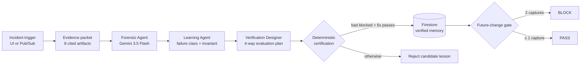

# Architecture

## One trustworthy loop



## Components and trust boundaries

| Component | Responsibility | May decide safety? |
|---|---|---|
| Forensic Agent | Evidence-cited causal synthesis; separate facts and unknowns | No |
| Learning Agent | Generalize to a reusable failure class and invariant | No |
| Verification Designer | Propose reproduction, corrected, held-out, and safety cases | No |
| Payment-state simulator | Execute provider side effects and count captures | **Yes** |
| Workflow | Require known-bad + corrected certification before verification | **Yes** |
| Firestore | Persist run state and verified memory | No |
| Pub/Sub | Deliver incident triggers to the Cloud Run push endpoint | No |

The most important boundary is between proposal and proof. Gemini's structured result can
change the name and description of a candidate control. It cannot fabricate a passing
capture count or set a final PASS/BLOCK decision.

## Agent data flow

ADK's `SequentialAgent` runs the three specialists. Each uses `output_schema` and
`output_key`; ADK validates the JSON and writes the result to session state. Later agents
consume only the original evidence and the preceding structured state.

```text
forensic_result     : ForensicFinding
learning_result     : GeneralizedLesson
verification_result : VerificationPlan
```

The application records an inspectable `agent_trace` with the author of each terminal
structured output. The live execution mode is `vertex-adk:gemini-3.5-flash`.

## Evaluator semantics

The provider simulator implements the same semantic boundary that matters in production:

1. an external capture can succeed;
2. its acknowledgement can be lost;
3. the worker can retry; and
4. provider deduplication is keyed by idempotency identity.

Attempt-scoped identities create two captures. A logical-operation-scoped identity returns
the original capture. The held-out case changes the trigger from acknowledgement timeout to
consumer crash + queue redelivery while preserving the causal failure class.

## Cloud topology

- Cloud Run service: `groundtruth`, `us-central1`, public, 0–2 instances.
- Firebase Hosting: `groundtruth-507213.web.app`, rewritten to the Cloud Run service.
- Vertex endpoint: `global`; model: `gemini-3.5-flash`.
- Firestore: `(default)`, Native mode, Standard edition, `us-central1`, free tier.
- Pub/Sub topic: `groundtruth-incidents`.
- Artifact Registry repository: `cloud-run-source-deploy`, `us-central1`.
- Runtime identity: `groundtruth-runtime@groundtruth-507213.iam.gserviceaccount.com`.

Cloud Run owns no long-lived secret. It uses its attached service-account identity and
Application Default Credentials.

The service uses instance-based CPU because an accepted asynchronous ADK run must continue
after the initiating response. Minimum instances remain zero and maximum instances remain
two, so the capability scales fully to zero and its compute ceiling is explicit.
